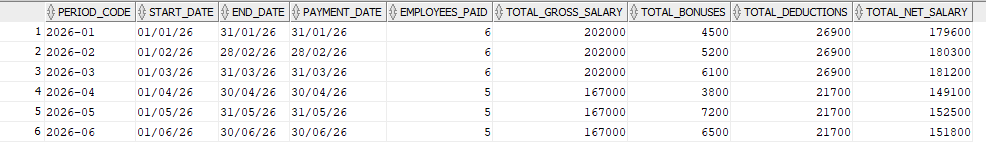
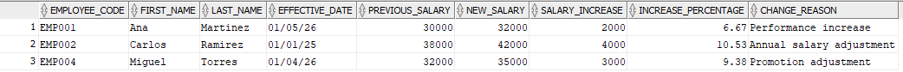
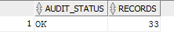
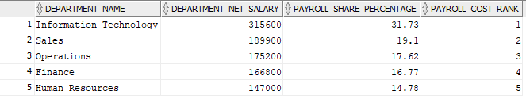
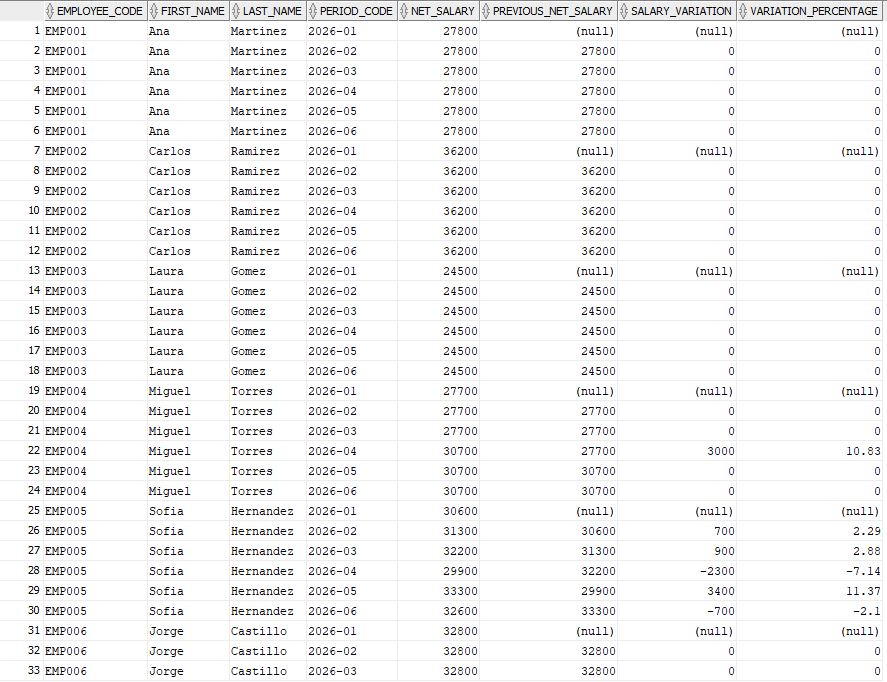
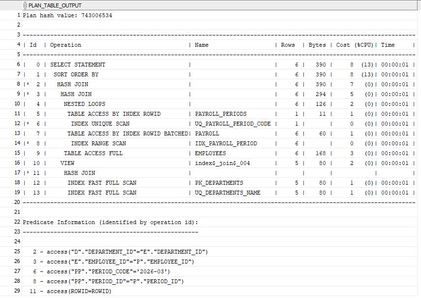

# Oracle Payroll Analytics

Oracle SQL portfolio project focused on employee payroll analysis, reporting, historical salary tracking, and data quality analysis.

## Business Problem

Payroll data is often distributed across employee, department, position,
salary-history and payment tables.

This project demonstrates how Oracle SQL can be used to transform that
relational data into useful business information, including:

- Monthly payroll costs
- Department payroll analysis
- Employee salary history
- Employee status and termination analysis
- Payroll anomaly detection
- Employee payroll trends
- Query performance analysis

## Database Architecture

The project uses the following main entities:

DEPARTMENTS
     │
     └── EMPLOYEES ─── POSITIONS
              │
              ├── SALARY_HISTORY
              │
              └── PAYROLL ─── PAYROLL_PERIODS

## Analytical Queries

The project includes several business-oriented SQL analyses.

### Monthly Payroll Summary

Provides monthly payroll totals including:

- Employees paid
- Gross salary
- Bonuses
- Deductions
- Net salary
- Month-over-month variation

### Employee Salary History

Analyzes:

- Salary increases
- Increase percentages
- Latest salary change
- Historical salary evolution

### Employee Status Analysis

Identifies:

- Active and terminated employees
- Employment duration
- Last payroll payment
- Payments after termination

### Payroll Anomaly Detection

Detects potential payroll issues such as:

- Incorrect net salary calculations
- Payments after termination
- Duplicate payroll records
- Invalid payroll values
- High deduction ratios
- Large salary increases

### Department Cost Analysis

Calculates:

- Payroll cost by department
- Department share of total payroll
- Department rankings
- Monthly payroll cost evolution

### Employee Payroll Trends

Includes:

- Cumulative payroll
- Average payroll
- Month-over-month changes
- Bonus analysis
- Employee payroll rankings

### Performance Analysis

Uses Oracle tools such as:

- `EXPLAIN PLAN`
- `DBMS_XPLAN`
- Index analysis
- Optimizer statistics

## Technologies

- Oracle Database
- SQL
- Oracle SQL Developer
- Git
- GitHub

## Oracle SQL Skills Demonstrated

This project demonstrates practical use of:

- JOIN
- LEFT JOIN
- GROUP BY
- HAVING
- CASE
- Common Table Expressions (CTE)
- ROW_NUMBER()
- RANK()
- DENSE_RANK()
- LAG()
- SUM() OVER()
- AVG() OVER()
- PARTITION BY
- Window functions
- Constraints
- Foreign keys
- Indexes
- EXPLAIN PLAN
- DBMS_STATS

## Project Structure

database/       Database schema and sample data
queries/        Business reports and analytical queries
views/          Oracle database views
docs/           Project documentation
screenshots/    Query results and project demonstrations

## How to Run

Execute the scripts in this order:

1. database/01_create_tables.sql
2. database/02_insert_sample_data.sql
3. database/03_create_indexes.sql

## Example Results

### Monthly Payroll Summary

### Salary History

### Payroll Audit

### Department Cost Analysis

### Employee Payroll

### Execution Plan

